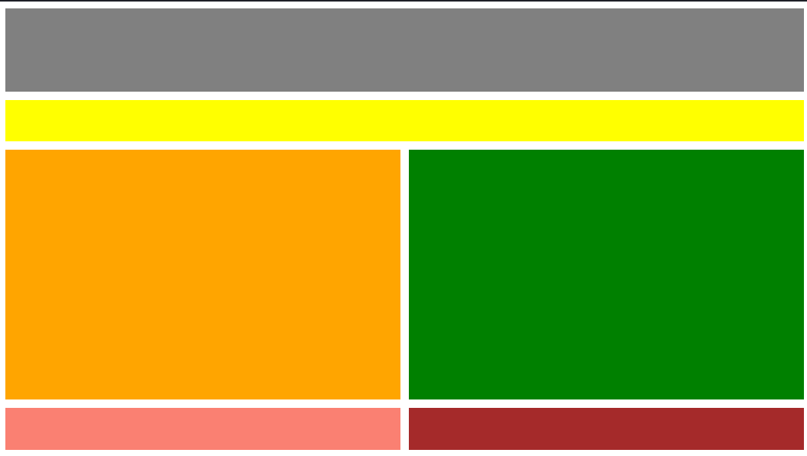

# _Layout With Grid CSS_

#### _Version 06/29/2020_

#### By _**Adilet Momunaliev**_

## Description

_Responsive Layout with grid css for mobile, tablet, and desktop._

### Specifications
* Responsive layout for mobile will list all grids vertically
* Responsive layout for tablet:;
* Responsive layout for desktop:;

## Technologies Used

_HTML, CSS, IDE Atom_

### License

*_Copyright (c) 2020 **Adilet Momunaliev**_*
